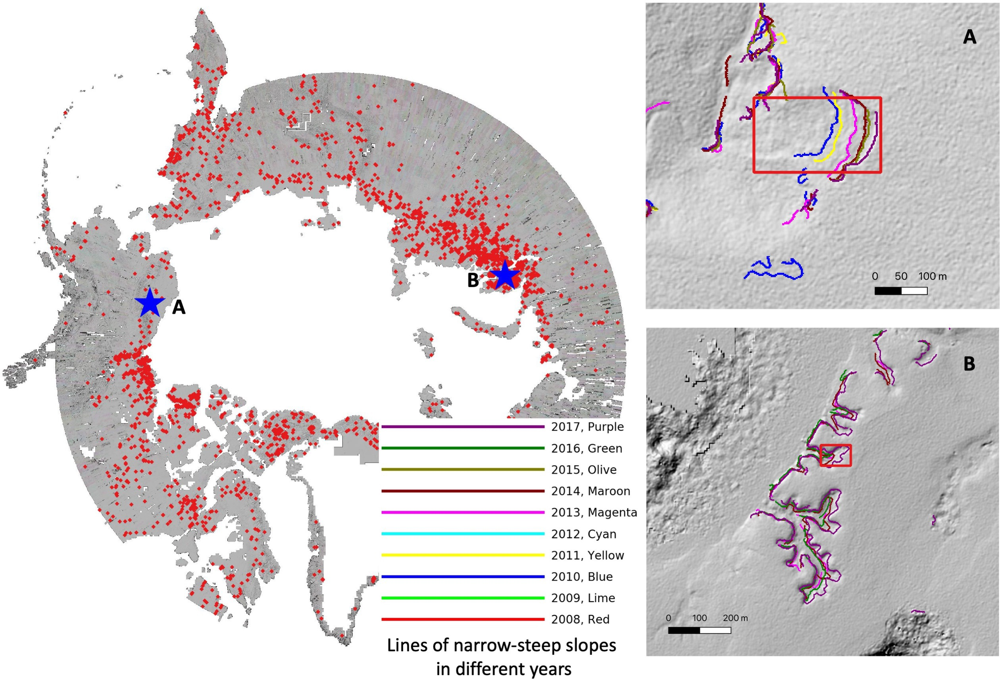

## Validate deep-learning-based mapping results of retrogressive thaw slumps 

### Introduction
We would like to invite people to validate retrogressive thaw slumps identified by deep learning techniques from around 200 TB of ArcticDEM. We developed a crowdsourcing system for the validation.
The system integrates ArcticDEM-derived data, online maps (Google satellite imagery and ESRI World imagery), and a form into one single window and is maintained by [Lingcao Huang](https://cires.colorado.edu/visiting-fellow/lingcao-huang). 

Retrogressive thaw slump (RTS) is a type of permafrost disturbance and is causing concerns because it changes local environment and affects northern communities, ecosystems, and global ecological processes such as carbon feedback. Due to climate warming, the number and affected areas of RTSs have increased significantly in past decades as documented by many local studies but their spatial distribution and evolution are still unknown in the entire permafrost region, which impedes the understanding and prediction of permafrost thawing. RTSs are in remote and harsh environments and are small as well as similar to their surroundings on remote sensing imagery, posting a challenge to map them either in the field or from satellite imagery.

<figure>

<figcaption align = "center"><b>Fig. 1a Ground photos of retrogressive thaw slumps, as shown in <a href="https://www.mdpi.com/2072-4292/14/12/2747">Huang et al. 2022</a></b></figcaption>
</figure>

<figure>

<figcaption align = "center"><b>Fig. 1b Screenshots of retrogressive thaw slumps from online satellite imagery. These do not correspond to that in Fig. 1a </b></figcaption>
</figure>

### Mapping results derived from ArcticDEM using deep learning and manual feature engineering
We utilized an open-access, high-resolution (2 m), and multi-temporal digital surface model (ArcticDEM) and an automated algorithm built on deep learning techniques and manual feature engineering, aiming to identify RTSs in the Arctic as many as possible and compile a dataset that can serve as a basic for future mapping and monitoring. We have obtained a preliminary mapping result after processing over 200 TB of ArcticDEM as shown in the following figure. However, one nature of the automated algorithm is that its results contain false positive and false negative. **Therefore, the results must be validated carefully before releasing them to scientific communities for further analysis and model calibration.** Pan-Arctic is a huge region, and this kind of validation cannot be completed by an individual or a small team.

<figure>

<figcaption align = "center"><b>Fig. 2 Preliminary mapping results (red rectangles) of retrogressive thaw slumps in the pan-Arctic. The background is composited imagery showing hill-shade and steep-narrow slopes with a spatial resolution of two meters. A and B are two zoom-in examples. The lines in different colors represent steep-narrow slopes in different years.</b></figcaption>
</figure>

### Crowdsourcing system
We developed a crowdsourcing system (the following figure) and would like to invite volunteers to validate the results.

<figure>

<figcaption align = "center"><b>Fig. 3 The crowdsourcing system integrates google satellite imagery (a), ESRI World Imagery Wayback (b), composited imagery derived from ArcticDEM (c), and a form (d) into a single window. In panel (c), users can add, edit, or remove lines, points, polygons, and rectangles using tools on the left, allowing users to add/edit/remove the bounding box of an RTS if it is a false negative/inaccurate result/false positive. Users can also hide the composited imagery by using the checkbox on the upper right. In panel (d), users can input the possibility (Yes, high, medium, low, and No) of an RTS and also comments. Users can use mouse (middle scroll) to zoom in/out in panel (c). </b></figcaption>
</figure>

Currently, our automated method identified 3176 potential RTSs in the pan-Arctic (Fig. 2), and each with a bounding box. We uploaded these bounding boxes and the corresponding composited imagery (around 2000 by 2000 pixels) to a server. During validation, each bounding box will be validated up to three times by different users. We expect these 3176 bounding boxes contain false positive and miss some RTSs (false negative). If you see RTSs in the surrounding region but don’t have the corresponding bounding boxes, please add polygons or rectangles for them. For this round of validation, we need up to 9528 (3176x3) inputs from all users. We believe that the number of RTSs in the pan-Arctic is larger than 3176 but the validation is necessary for the improvement of future mapping efforts. 

### How to contribute (A [demo](https://youtu.be/ly7QRXTiBaQ) on Youtube)
1.	Open [LabelEarth](http://labelearth.colorado.edu) then follow the instruction to log in. We suggest using a computer with a large screen for this task.
2.	After login, you can start to validate/identify RTSs one by one. You can check google satellite imagery and ESRI World imagery Wayback in panel (a) and (b),  zoom in/out if necessary. In Panel (c), users can also hide the composted imagery by clicking the checkbox, then check the ESRI World imagery in the background. After checking all online maps, users can decide if the bounding box in Panel (c) is true or false positive. In panel (c), if you spot some RTSs without bounding boxes, please add polygons or rectangles for them. If the original bounding boxes is false positive, you can remove/edit it, but it’s ok if you leave it as it is.
3.	In panel (d), you can choose the possibility from Yes, High, Medium, Low, and No for the original bounding box. If you are sure that it is an RTS or not, then choose Yes or No, respectively. If there is an ambiguity, you can choose a possibility from High, Medium, and Low. You don’t need to assign possibilities to the newly added polygons/rectangles because these are already considered as RTSs by you. We will consider further validation of them in the future but not in this round. 
4.	You can input comments in the note (Panel d) if you have some thoughts or observe something interesting for this bounding box or location. After all set, click “Submit and Next”, the system will save your input to the server on the campus of University of Colorado Boulder and show you the next bounding box for validation.
5.	If you want to revise the previous input, you can click “previous” and retrieve your input from the server, then modify it and click “Submit and Next” again.
6.	Close the window if you want to stop, login to [LabelEarth](http://labelearth.colorado.edu) again if you want to validate more. You can validate a few or many as you want.

<!-- **A [video](https://youtu.be/9YQpNbjgVeQ) (no sound) showing how to use the crowed-sourcing system is on Youtube.**  -->

### Some notes
1. The three panels (a, b, and c) show imagery in the same geographic location, but they are independent and don't zoom in/out simultaneously. The shortcut for zoom in/out panel (a) is different from others and is designed by the online map. The background imagery in panel (c) is similar to the imagery in panel (b), but for some locations, panel (c) may have multi-temporal imagery. By selecting "Only versions with local changes" in panel (b), users can view other available high-resolution imagery in the Wayback. 
2. The "previous" button only goes back to bounding boxes and the corresponding imagery you have contributed to. "Submit and Next" only goes to the bounding boxes and imagery that haven't been validated 3 times by different users, and you didn't contribute to. If you view a bounding box but don't submit your results, it will be hidden for you in the next 12 hours and may be validated by other users. 
3. The acquisition time of source data for composited imagery, google satellite imagery, and ESRI World imagery may be different, leading to different boundaries of retrogressive thaw slumps or different features at the same location. 

### Contact
Contact for any bugs, comments, suggestions, and questions: Lingcao Huang (lingcao.huang@colorado.edu).

### Q & A
- Could you share your data?

_We are happy to share the data we derived from ArcticDEM. The intermediate data include polygons of elevation reduction, lines of narrow-steep slopes, composited imagery and have a size of over 6 TB. The dataset can be used for other research. We are looking for a public domain to host this dataset. After this round of validation, we are also happy to share the bounding boxes of retrogressive thaw slumps._

- What's the technical details of the algorithm for the data processing?

_We are writing a technical paper to summarize the technical details, stay tune._ 

